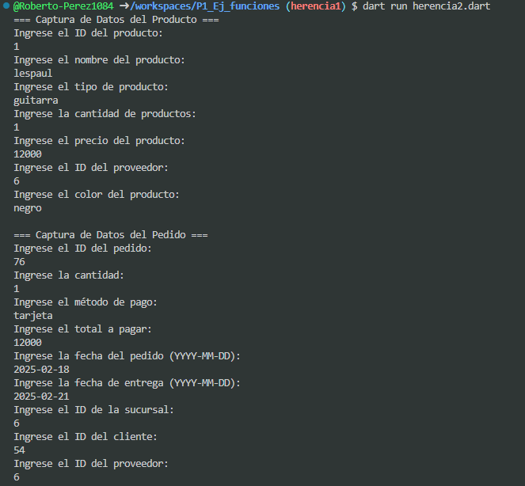

* crear la clase producto con los atributos (id_producto, nombre_prod, tipo_prod, cant_prod, precio_prod. id_proveedor, color_prov) con una funcion capturadatos(), con interaccion de interfaz de usuario. crear la clase Pedidos con los atributos (id_pedido, cantidad, metodo_pag, total_pag, fecha_ped, fecha_entrega, id_sucursal, id_cliente, id_producto) con herencia mascota y una funcion mostrarDatos() lenguaje dart

salida

