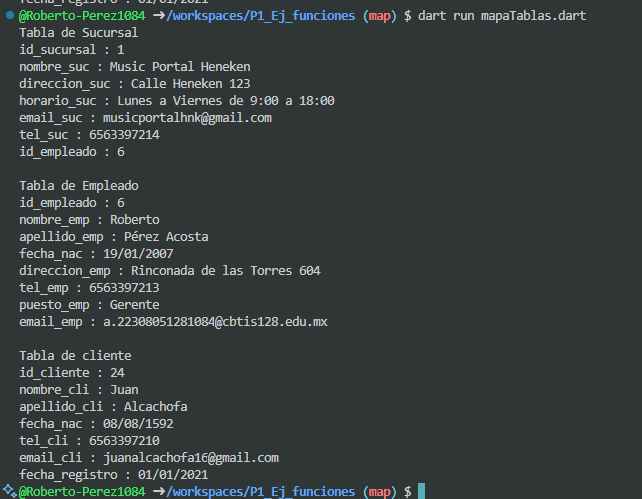

* crear map <string, dynamic> sucursal con los siguientes key, id_sucursal, nombre_suc, direccion_suc, horario_suc, email_suc, tel_suc, id_empleado. lenguaje dart y mostrar los datos con un foreach

* crear map <string, dynamic> empleado con los siguientes key, id_empleado, nombre_emp, apellido_emp, fecha_nac, tel_emp, puesto_emp, email_emp. lenguaje dart y mostrar los datos con un foreach

* crear map <string, dynamic> cliente con los siguientes key, id_cliente, nombre_cli, apellido_cli, fecha_nac, tel_cli, email_cli, fecha_registro. lenguaje dart y mostrar los datos con un foreach

salida:

